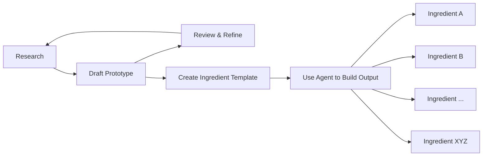

# AI Ingeredient Encyclopedia

## Table of Contents
- [Carrot](ingredients/carrot_v2.md)
- [Celery](ingredients/celery_v2.md)
- [Green Onion | Non-AI](ingredients/green_onion_vhuman.md)
- [Potatoes](ingredients/potatoes_v2.md)
- [Tomatoes](ingredients/tomatoes_v2.md)

## Project Overview
- **Project Name:**  Ingredient Encyclopedia
- **Date:**  2025-10-01
- **Duration:** 1 week 

## Goals & Objectives
- What are painpoints or problems the project aimed to solve?
    - Lack of a centralized, comprehensive resource for ingredient information.
    - Difficulty in finding reliable and detailed information on ingredient usage, storage, and preparation without all the SEO fluff.
        - Reliable information considering the raised concerns about AI-generated content accuracy.
    - Need for a user-friendly format that caters to both novice and experienced cooks.
- What were the initial goals?
    - Create a comprehensive and user-friendly ingredient encyclopedia.
    - Include detailed information on various ingredients, including usage, storage, and preparation tips.
    - Ensure user accessibility and ease of navigation by intentionally structuring content for knowledge dissemination at different stage of a home cook's need. 
    - Ensure high-quality images and formatting for better readability.
    - Implement an AI workflow to assist in content generation and editing.
- Were they met? Why or why not?
    - Partially met. The encyclopedia was created with detailed information and user-friendly formatting. However, some sections may require further refinement and additional content to fully meet the initial goals.
    - The AI workflow was implemented but needs optimization for better accuracy and efficiency.

## Successes
- What went well?
    - Understanding the structure and format of the encyclopedia.
    - Creation of a visually appealing and organized layout.
    - Effective use of AI tools to generate and edit content.
        - Research - help find relevant information and generate the initiate content.
        - Draft Prototype - There were parts that requires personal touch and experimentations to refine the content such as formating and image selection.
        - Reivew & Refine - Iterative process to ensure the content is complete and yet concise.
        - Create Ingredient Template - Standardized template for consistency across entries. AI helps ask questions to generalize and find edge cases that my intitate draft wouldn't cover such as fresh produce versus dried grains.
        - Use Agent to Build Output - Automated process to generate multiple entries based on the template.

- Key achievements and milestones.
    - Determining the feasibility of the project within the given timeframe.
    - Successfully generating initial content for several ingredients.
    - Implementing a basic AI workflow for content generation and editing.

## Challenges & Issues
- What problems were encountered?
    - Incorrect images: unrelated images, broken links, using AI generated images, inconsistent image selection such as with people, different settings, etc. 
        - solutions: included in task to analyze image to confirm it matches the ingredient, added checks to confirm link work, repeat if failure. Unable to fully automate the image selection.
    - Inconsistent formatting: variations in headings, bullet points, and overall structure across different entries.
        - solutions: more deep dive into different ingredient categories to understand the nuances and edge cases, added more detailed instructions to the agent to handle these cases.
- Were there any unresolved issues?
    - Stop improving the worfklow after quickly assessing cost versus benefit.

## Lessons Learned
- What could have been done differently?
    - The aim of the project could have been more narrowly defined to focus more generalized knowledge such as selecting fresh produce in general rather than specific to each ingredient which requires more domain expertise and is harder for people remember. In fact, readers would be more stress by too many details and needing to refer to the encyclopedia for every ingredient.
    - By focusing on generlized knowledge, the project could have been completed faster and with higher quality by having more time to refine the content and format.
    - The workflow would be simplified by focusing on creating human agents for the research, review, and refinement stage and therefore no need for complicated agent to apply a template on hundreds of ingredients which is also harder to control the output quality and deal with all the nunances of each ingredient.
- Insights for future projects.
    - Keep the scope small until the workflow is well established and optimized.

## Action Items
- Next steps and follow-up actions.
    - Redefine the project scope to focus on generalized knowledge.
